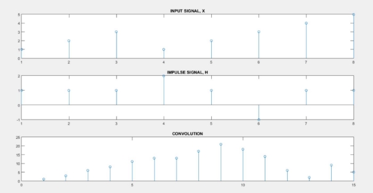
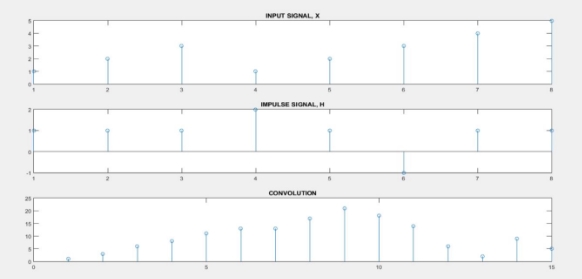

                Heaven’s Light is Our Guide

     Rajshahi University of Engineering & Technology 

**Sessional Course Code**: ECE 4124 

**Course name**: Digital Signal Processing Sessional 

**Submitted To:** 

Hafsa Binte Kibria 

Lecturer, ECE, 

RUET                                                                 

**Submitted By:** 

Mahbuba Habib 

ID: 1810026 

Department: ECE 

**INDEX**

|Serial No |Topic |Page no |
| - | - | - |
|1 |Experiment No. & Date |3 |
|2 |Experiment Name |3 |
|3 |Objective |3 |
|4 |Theory |3 |
|5 |Required Tools |4 |
|6 |Code & Output |4 |
|7 |Discussion |6 |
|8 |Conclusion |6 |
|9 |References |6 |

**Experiment No**: 01 Experiment Date: 19/03/23 

**Experiment Name**: Convolution of 2 signals using conv function and without using conv function. 

**Objective**: 

- Familiar with the conv function 
- Problem solving without using conv function 
- Realtime implementation and visualization of 2 outputs 

**Theory**: A convolution is an integral that expresses the amount of overlap of one function  as it is shifted over another function  . It therefore "blends" one function with another. 

Let x be the input signal to a linear system L and let the output be y=Lx. We can write x as an integration (summation) of shifted pulses: 

x(t)=∫∞−∞x(u)δ(u−t) du Because δ(x)=δ(−x), we can also write: 

x(t)=∫∞−∞x(u)δ(t−u) du=∫∞−∞x(u)δu(t)du 

where δu(t) is the function δ shifted to the left-over u. Now look at Lx. Because of the linearity of L, it can be written: 

(Lx)(t) =∫∞−∞x(u)(Lδu) (t)du 

Shift invariance of the operator implies that (Lδu) =(Lδ) u, i.e. first shifting and then applying the operator is the same as first applying the operator and then shift.Obviously Lδ is the pulse response of the linear system, let’s call it the function h, then we get: 

(Lx)(t) =y(t)=∫∞−∞x(u)h(t−u)du or equivalently:                                     y=x∗h 

the output of a shift invariant system is given by the convolution of the input signal with the impulse response function of the system. In the signal processing literature it is common to write: 

y(t)=x(t)∗h(t) 

**Required Tools**: MATLAB 2015a. 

**Code & Output**: 

1.Convolution using conv function. 

clear all; 

close all; 

n1 = 0 : 1 : 7; 

y1 = [ 1 2 3 1 2 3 4 5 ]; h1 = [ 1 1 1 2 1 -1 1 1 ]; X = conv (y1, h1); 

n2 = 0 : length(X)-1; figure(1) 

subplot(3,1,1) 

stem(y1) 

title('INPUT SIGNAL, X') subplot(3,1,2) 

stem(h1) 

title('IMPULSE SIGNAL, H)'); subplot(3,1,3) 

stem(X) title('CONVOLUTION'); 

Figure1: Convolution of 2 numbers using conv 

2. Convolution without using conv function. 

clear all; 

close all; 

x=[ 1 2 3 1 2 3 4 5 ]; 

h=[ 1 1 1 2 1 -1 1 1 ]; n=length(x) + length(h)-1 

k = max(length(x) , length(h)) x=[x,zeros(1,k-length(x))] h=[h,zeros(1,k-length(x))] for i =1:1:n 

`  `y(i)=0; 

`  `for j=1:1:k 

`    `if(i-j<0) 

`      `y(i)=y(i)+0 

`    `elseif(i>k) 

`    `if (j+(i-k)<=k) 

`     `y(i) = y(i)+ x(j+(i-k))\*h((i-j)-(i-(k+1))); 

endif 

`    `else 

`      `y(i) = y(i)+x(j)\*h(i-j+1); 

`     `endif   endfor  endfor 

subplot(3,1,1) 

stem(x) 

title('INPUT SIGNAL, X') subplot(3,1,2) 

stem(h) 

title('IMPULSE SIGNAL, H'); subplot(3,1,3) title('CONVOLUTION'); stem(y) 

Figure2: Convolution of 2 numbers without using conv 

**Discussion**: This experiment is mainly focused on the convolution of 2 signals. The code is done in 2 different ways. Both of them give the same output. 

**Conclusion**: We tried to find out the convolution of 2 signals. The output resembles to our theory. 

**References**: 

1. DSP - Operations on Signals Convolution 

https://www.tutorialspoint.com/digital\_signal\_processing/dsp\_operations\_on\_signals\_convolution .htm/ [Online]. [Accessed May1, 2023] 

2. Convolution 

https://www.analog.com/media/en/technical-documentation/dsp-book/dsp\_book\_ch6.pdf [Online]. [Accessed May1, 2023] 

May 1, 2023  6 

