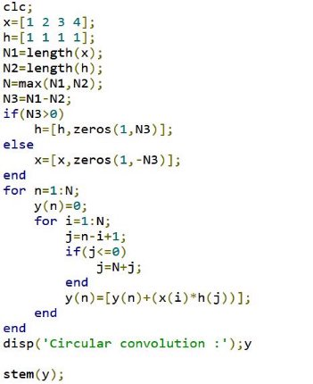
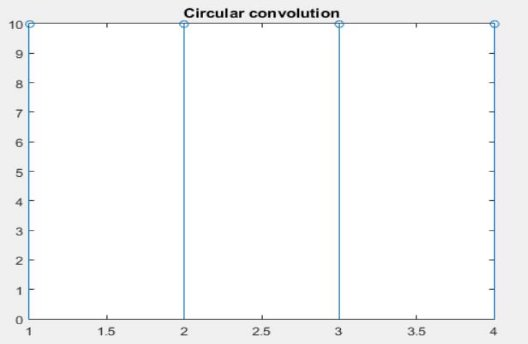
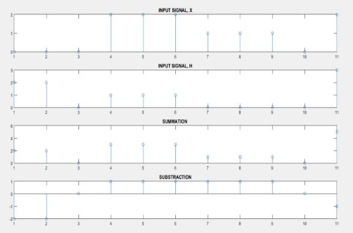
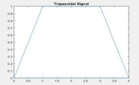
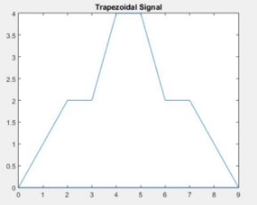

                    Heaven’s Light is Our Guide

            Rajshahi University of Engineering & Technology 

**Sessional Course Code**: ECE 4124 

**Course name**: Digital Signal Processing Sessional 

**Submitted To:** 

Hafsa Binte Kibria 

Lecturer, ECE, 

RUET                                                                 
**Submitted By:** 

Mahbuba Habib 

ID: 1810026 

Department: ECE 

**INDEX**

|Serial No |Topic |Page no |
| - | - | - |
|1 |Experiment No. & Date |3 |
|2 |Experiment Name |3 |
|3 |Objective |3 |
|4 |Theory |3 |
|5 |Required Tools |4 |
|6 |Code & Output |4 |
|7 |Discussion |7 |
|8 |Conclusion |7 |
|9 |References |7 |

**Experiment No**: 02 Experiment Date: 03/05/23 

**Experiment Name**: Perform the following task: - 

1. Circular convolution of 2 signals. 
1. Sum and subtraction of 2 signals and show them in a figure. 
1. Perform 2 types of trapezoid signal. 

**Objective**: 

- Familiar with the circular convolution 
- Problem solving and show different types of output 
- Realtime implementation and visualization of 2 outputs 

**Theory**: Circular convolution, also known as cyclic convolution, is a special case of periodic convolution, which is the[ convolution ](https://en.wikipedia.org/wiki/Convolution)of two periodic functions that have the same period. It can be performed using two methods: concentric circle method and matrix multiplication method. Assuming x1(n) and x2(n) as two finite sequences of length N. 

Now let us consider X1(K) and X2(K) as the inverse DFTs of sequences x1(n) and x2(n). The[ DFT ](https://en.wikipedia.org/wiki/Discrete_Fourier_transform)for the sequences is 

Let x3(n) be one more sequence with DFT X3(K). The relation between the three finite duration sequences is given as 

After taking inverse discrete[ Fourier transform ](https://www.goseeko.com/blog/what-is-fourier-transform/)of above sequences we have 

The above equation can also be written as 

**Required Tools**: MATLAB 2015a. 

**Code & Output**: 

1. Circular convolution of 2 signals. 

Figure1: Circular convolution of 2 signals  

2. Addition and subtraction of 2 functions 

Figure2: Addition and subtraction of 2 signals 

3. Trapezoidal signal 

Figure2: Generation of trapezoidal signals 

**Discussion**: This experiment is mainly focused on the circular convolution of 2 signals and implementation of different types of signals. The code is done in 3 steps. All of them give the desired output. 

**Conclusion**: We tried to find out the circular convolution of 2 signals. Besides, we tried to implement code for given signals. The output resembles to our theory. 

**References**: 

1. DSP - Circular Convolution 

https://www.goseeko.com/blog/what-is-circular-convolution// [Online]. [Accessed May3, 2023] 

2. Discrete-Time Signal Processing https://ocw.mit.edu/courses/6-341-discrete-time-signal-processing-fall- 2005/6e5190ef6e0d66c78bfdce2be6ce7125\_lec16.pdf [Online]. [Accessed May3, 2023] 
2. Circular Convolution 

https://en.wikipedia.org/wiki/Circular\_convolution// [Online]. [Accessed May3, 2023] 

May 3, 2023  7 
