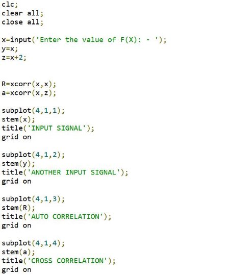
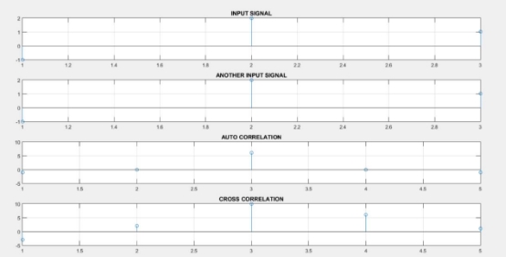
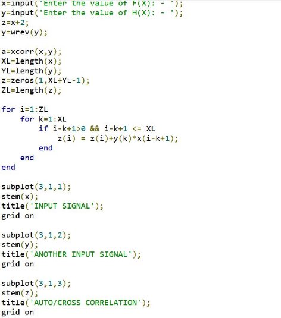
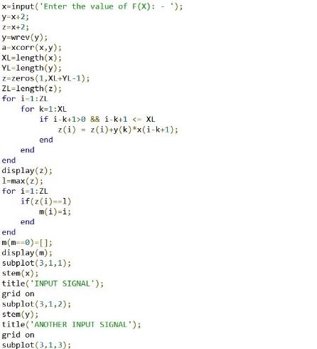
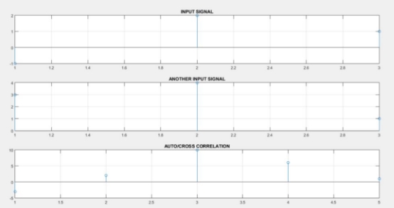
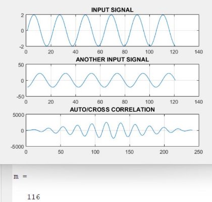

Heaven’s Light is Our Guide

`                       `Rajshahi University of Engineering & Technology 

Sessional Course Code: ECE 4124 

`   `Course name: Digital Signal Processing Sessional 

**Submitted To:** 

Hafsa Binte Kibria 

Lecturer, ECE, 

RUET                                                                 

` `**Submitted By:** Mahbuba Habib ID: 1810026 Department: ECE 

Experiment No: 03

Experiment Date: 8/05/23 

Experiment Name: Correlation of 2 signals using function and without using function. 

Objective: 

- Familiar with the correlation concept 
- Problem solving with & without using function 
- Realtime implementation and visualization of 2 outputs -Find the X value of highest correlation 

Theory: Correlation coefficient is a measure of how well two signals are related to each other in terms of their similarity, alignment, and dependence. It is widely used in digital signal processing (DSP) for various purposes, such as signal detection, estimation, compression, enhancement, and classification. The *correlation* of two functions or signals or waveforms is defined as the measure of similarity between those signals. There are two types of correlations − 

- Cross-correlation 

The cross-correlation between two different signals or functions or waveforms is defined as the measure of similarity or coherence between one signal and the time-delayed version of another signal. The cross-correlation between two different signals indicates the degree of relatedness between one signal and the time-delayed version of another signal. 

- Autocorrelation 

The autocorrelation function is defined as the measure of similarity or coherence between a signal and its time delayed version. Therefore, the autocorrelation is the correlation of a signal with itself. 

Required Tools: MATLAB 2015a. 

Code & Output: 

1\.  Correlation using xcorr function. 

Figure1: Correlation using xcorr() function 

Figure2: Correlation without using xcorr() function 

Figure3: Finding the X position of highest correlation. 

Figure4: Finding the X position of highest correlation in continuous signal 

Discussion: This experiment is mainly focused on the correlation of 2 signals. The code is done in 2 different ways. Both give the same output. Later the position of X value is calculated. 

Conclusion: We tried to find out the correlation of 2 signals. The output resembles our theory. 

References: 

1. What is Correlation in Signals and Systems?

https://www.tutorialspoint.com/what-is-correlation-in-signals-and-systems  [Online].  [Accessed May8, 2023] 

2. Understanding Correlation https://www.allaboutcircuits.com/technical-articles/understanding-correlation/ [Online]. 

[Accessed May8, 2023] 

3\.correlation coefficient in DSP 

https://www.linkedin.com/advice/0/what-some-common-applications-correlation [Online]. 

[Accessed May8, 2023] 
May 8, 2023  7 
