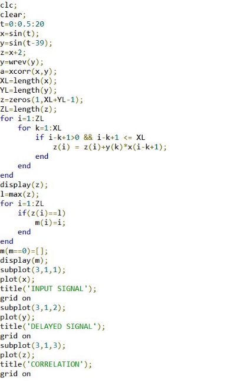
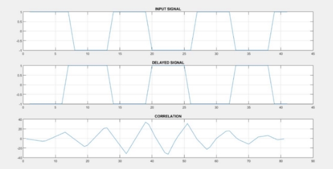

             Heaven’s Light is Our Guide

     Rajshahi University of Engineering & Technology 

**Sessional Course Code**: ECE 4124 

**Course name**: Digital Signal Processing Sessional 

**Submitted To:** 

Hafsa Binte Kibria 

Lecturer, ECE, 

RUET                                                                 

**Submitted By:**

 Mahbuba Habib 
 
 ID: 1810026 
 
 Department: ECE 

**Experiment No**: 04 Experiment Date: 15/05/23 

**Experiment Name**: Correlation of a signal with its delayed function and find the x ordinate value. 

**Objective**: 

- Familiar with the correlation concept 
- Problem solving with & without using function 
- Realtime implementation and visualization of 2 outputs -Find the X value of highest correlation 

**Theory**: Correlation coefficient is a measure of how well two signals are related to each other in terms of their similarity, alignment, and dependence. It is widely used in digital signal processing (DSP) for various purposes, such as signal detection, estimation, compression, enhancement, and classification. The *correlation* of two functions or signals or waveforms is defined as the measure of similarity between those signals. There are two types of correlations − 

- Cross-correlation 

The cross-correlation between two different signals or functions or waveforms is defined as the measure of similarity or coherence between one signal and the time-delayed version of another signal. The cross-correlation between two different signals indicates the degree of relatedness between one signal and the time-delayed version of another signal. 

- Autocorrelation 

The autocorrelation function is defined as the measure of similarity or coherence between a signal and its time delayed version. Therefore, the autocorrelation is the correlation of a signal with itself. 

**Required Tools**: MATLAB 2015a. 

**Code & Output**: 

Figure4: Finding the X position of highest correlation in continuous signal 

**Discussion**: This experiment is mainly focused on the correlation of 2 signals. The code gave the desired output. Later the position of X value is calculated. 

**Conclusion**: We tried to find out the correlation of 2 signals. The output resembles our theory. 

**References**: 

1. What is Correlation in Signals and Systems?

https://www.tutorialspoint.com/what-is-correlation-in-signals-and-systems  [Online].  [Accessed May 18, 2023] 

2. Understanding Correlation https://www.allaboutcircuits.com/technical-articles/understanding-correlation/ [Online]. 

[Accessed May 18, 2023] 

3\.correlation coefficient in DSP 

https://www.linkedin.com/advice/0/what-some-common-applications-correlation [Online]. 

[Accessed May 18, 2023] 
May 18, 2023  4 
