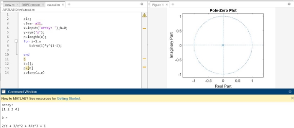
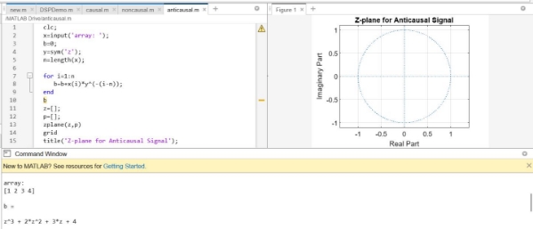
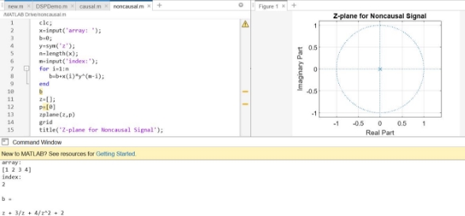

                Heaven’s Light is Our Guide

        Rajshahi University of Engineering & Technology 

**Sessional Course Code**: ECE 4124 

**Course name**: Digital Signal Processing Sessional 

**Submitted To:** 

Hafsa Binte Kibria 

Lecturer, ECE, 

RUET                                                                 

**Submitted By:** 

Mahbuba Habib 

ID: 1810026 

Department: ECE 

**Experiment No**: 05

**Experiment Date**: 22/05/23 

**Experiment Name**: Study of Causal, Non-causal and Anti causal Signals 

**Objective**: 

- Familiar with the causal, anti-causal and non-causal signal. 
- Practically implement it with a function. 

**Theory**: A causal system is the one in which the output y(n) at time n depends only on the current input x(n) at time n, and its past input sample values such as x(n−1), x(n−2),….  it does not exist for negative time. 

` `If a system output depends on future input values such as x(n+1), x(n+2), …, the system is[ anti-causal.](https://www.sciencedirect.com/topics/engineering/noncausal) It is equal to zero for all positive time values.  

It contains both positive and negative time values. The noncausal system cannot be realized in real time. 

**Required Tools**: MATLAB 2015a. 

**Code & Output**: 

Fig1: Implementation of causal signals 

`          `Fig2: Implementation of anti-causal signals 

Fig3: Implementation of non-causal signals 

**Discussion**: This experiment is mainly focused on implementation of causal, anti-causal and non-causal system. The code gave the desired output. Later the position of X value is calculated. 

**Conclusion**: We tried to plot the poles and zeros of causal, anti-causal and non-causal signals. The output resembles our theory. 

**References**: 

1\. Causal, Noncausal and Anti-causal signals

https://www.tutorialspoint.com/signals-and-systems-causal-non-causal-and-anti-causal-signals [Online]. [Accessed August 18, 2023] 
May 18, 2023  4 
